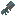

# NanoMirai
[日本語](README_ja.md)

NanoMirai is a Minecraft mod based on nanotechnology. You can use nanomachines to enhance yourself and generate various resources.

## Items Added
### Synth Nano 
A nanomachine that transforms various blocks using catalysts.

### Support Nano 
Nanomachines that connect to the player to enhance abilities.
### Nano Swarm Blaster 
A weapon that fires swarms of nanomachines to apply debuffs to enemies.
### Nanomachine Assembler 
A dedicated machine for assembling nanomachines.
### Laser Engraver 
A machine that processes various items with lasers to convert them into other items.

### Nano Lab 
A research facility for granting special effects to nanomachines.

---
## Prerequisite Mods
- Kotlin for Forge
- Curios API
- JEI (optional but recommended)
