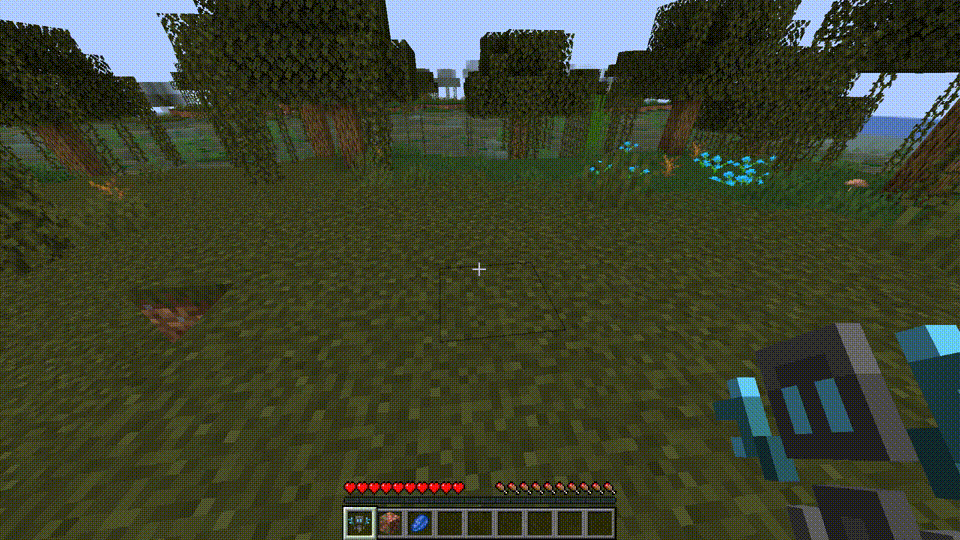
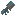
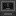
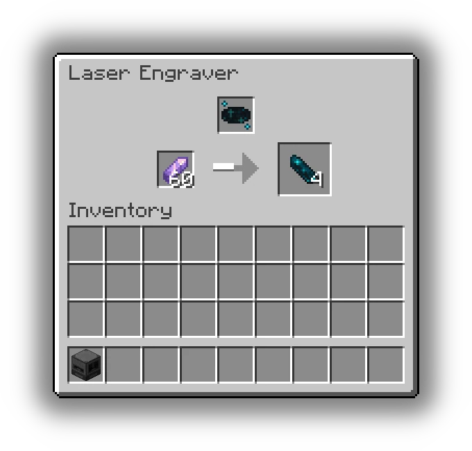
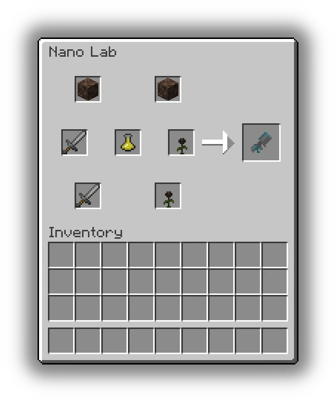

# NanoMirai

NanoMiraiは、ナノテクノロジーをベースにしたMinecraftのModです。ナノマシンを使用して自身を強化したり、様々なリソースを生み出すことができます。

## 追加されるアイテム
### シンセナノ 
触媒を元に様々なブロックを変換するナノマシン。

### サポートナノ 
プレイヤーに接続し、プレイヤーの能力を強化するためのナノマシン。
### ナノスウォームブラスター 
ナノマシンの群れを発射し、敵にデバフを与える武器。
### ナノマシン組み立て機 
ナノマシンを組み立てるための専用機械。
### レーザー加工機 
様々なアイテムをレーザーで加工し、別のアイテムに加工する機械。

### ナノラボ 
ナノマシンに特殊な効果を付与するための研究施設。

---
## 前提Mod
- Kotlin for Forge
- Curios API
- JEI (任意、あると良い)
